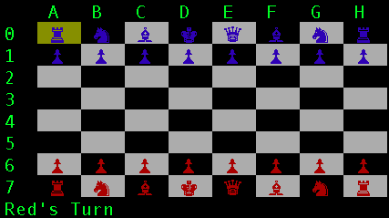

# CHESS

A console-based Chess board game fully featured for two players.

# REQUIREMENTS

Ruby must be installed. (At least version 2.0.0)

# HOW TO PLAY

Type "ruby chess.rb" into the command line.
Use the arrow keys to move the cursor and enter to confirm input.

# SCREENSHOT

